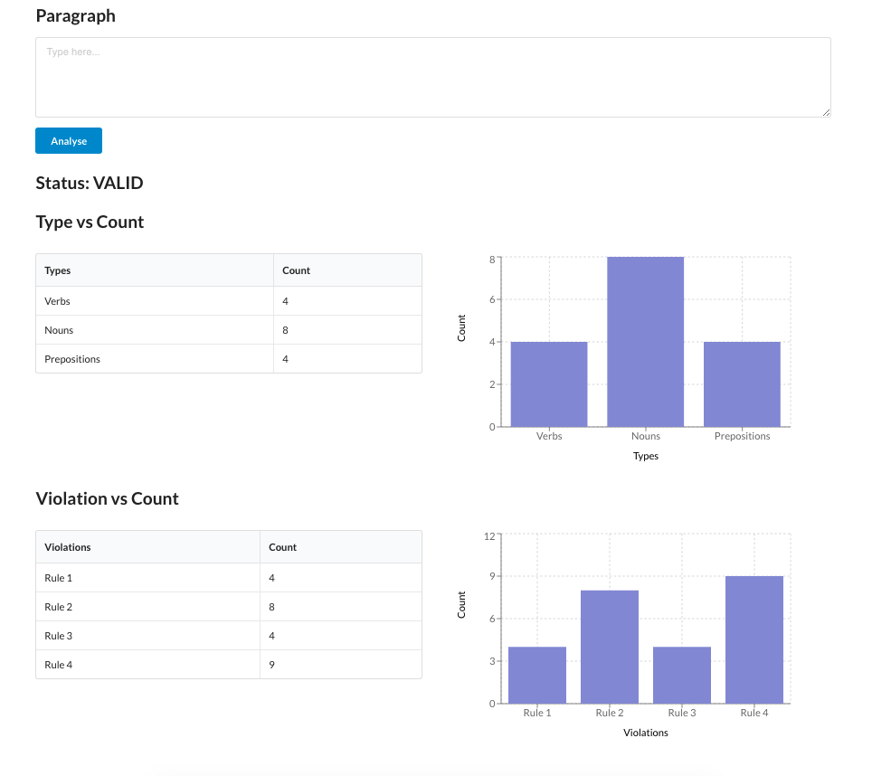

# Prospection coding exercise #

The exercise is in spring boot. It uses gradle, React

So firstly, setup:

1. Clone the provided repo and create a branch to submit your work
2. Import the spring boot project to your IDE(Optional).
3. Run the project backend with IDE or `./gradlew bootrun`
4. Go to frontend folder by `cd frontend`, run `npm install` then `npm start` it will open your browser with url `http://localhost:3000/`.
 
After these steps you should see a web page where a few components are wired up, but the numbers are not real. You will fix that.

**_IMPORTANT !!!_**

**_Feel free to add dependencies and change the project structure as you see fit_**

**_If something is not clear, write down an assumption in the code and move on_**
     
# The task at hand

We are creating a new fantasy world where the characters will speak and write a new language.

They all live in the same country and the grammar is well-defined.

Based on the grammar definition we can extract some rules.

You will then validate a piece of text against these rules.

We are defining the language with the following concepts:

## Alphabet

The alphabet is quite simple and has the following characters:

    abcdefghijlmnopqurs

They can be lowercase or uppercase letters.

It also contains Space, ".", "!".

**_Rule 1_**: no other characters are valid

## Words

Words contain from 1 to 8 characters and are separated by one or more spaces.

**_Rule 2_**: words that's longer than 8 letters are invalid

## Verbs

Verbs are words comprised of 4-5 characters.

They have 2 tenses: Past, Present and Future.

* Past verbs are ending in "d".

* Present verbs are ending in "r".

* Future verbs are ending in "l".

**_Rule 3:_**: verbs must end in d, r or l

## Nouns

Nouns are words comprised of 6-8 characters.

## Prepositions

Prepositions are words composed of 1-3 characters.

## Sentences

Sentences always start with uppercase letters.

Sentences always end with a dot "." or "!" if it's the end of a paragraph.

**_Rule 4_**: Sentences are a combination of at least one Verb, Preposition and Noun.

## Paragraph

Paragraphs are a block of consecutive text with up to 3 sentences. There are no line breakers in paragraphs.
Each new paragraph stars in a new line and ends with exclamation sign "!".

**_Rule 5_**: Paragraphs have 1 to 3 sentences.

**_Rule 6_**: Paragraphs end with an exclamation sign "!"

# Your goals

Implement an algorithm that accepts a String and validates it against the grammar above.

Present the results in a UI.

**Please describe what is needed to make your code production ready.**

**You can do that by implementing the production ready aspects or describing in your pull-request comments**  

## Backend

The backend code should provide a REST API to be consumed by the frontend.

This API must return:

* VALID or INVALID status

* It should list all the errors it finds 

* it should output the count of Verbs, Nouns, Prepositions, Sentences and Paragraph.

## Frontend

The front end is being partially provided(frontend folder - check README) as a React Single Page Application.

There is an input text, and the outcome is 2 sets of table and chart pairs.

The UI should look like this:

## Examples

### Valid

    Cufabiu maffas nonad in auguec finibu soliciu. Mauhis arcusu semihe ir digil quisam impediec es macir quisua nullac. Nullam quir poral ac merul!
    Doneca punar de us nequl placeran sincdun. Neqed nil ulrices es hiraec qua rempl lacuse hisaec ers!

### Invalid

    Nunddz id ulits orci. Cufabiu nonad in augueculrices. Aenean aucbor purusa.
    Vivamus libero enim, sagittis at nulla in, malesuada pretium nunc. Donec punar de, ut nequl placeran tincdun. Neqed nil ulrices es. Vitae qua templ lacuse vitaec est!
    
### Result Validation

Text | Status
:--- | :---  
Nunddz, sagittis, ut, tincdun | Rule 1 - invalid character
augueculrices | Rule 2 - word is too long
Ulics | Rule 3 - verb not ending with d, r or l
Aenean aucbor purusa. | Rule 4 - no preposition at the sentence
1st paragraph | Rule 5 - not ending with "!"
2nd paragraph | Rule 6 - too many sentences

# Submission

Create a branch out of the repo, submit pull-request and notify us about completion

## Assumptions

* Rule #4
    * sentence is considered valid as long as it has a proper noun, verb and preposition to keep the solution simple
* Used Integer data type for simple and better code readability